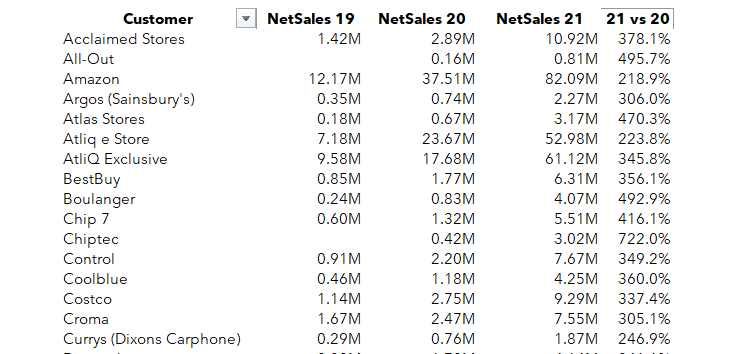
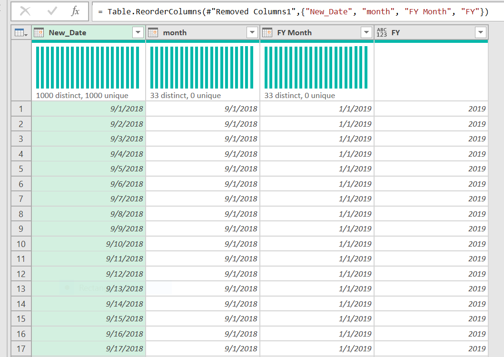
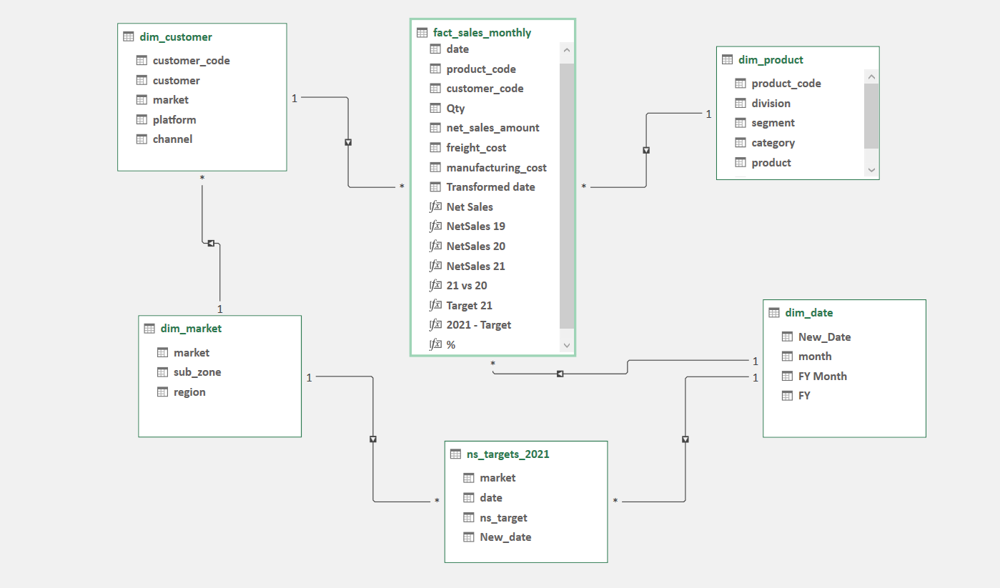
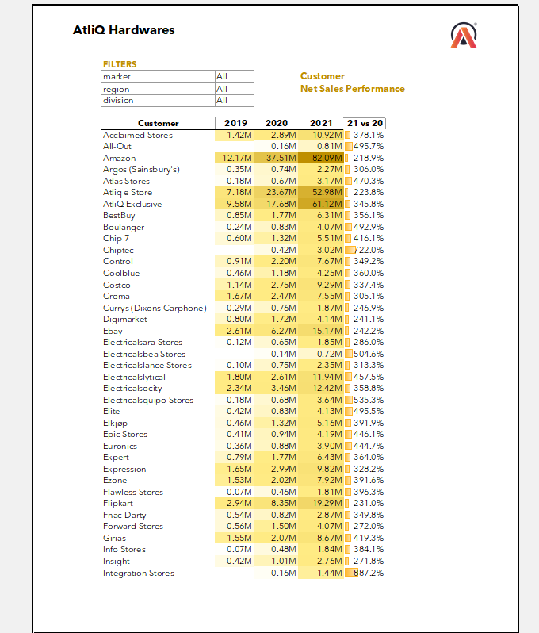
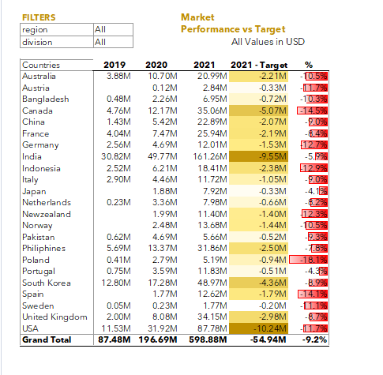

# Sales-Analysis-Report-with-Microsoft-Excel

## Introduction
AtliQ is a fictitious prominent computer hardware manufacturer and distribution company that supplies a wide range of products including computers, printers, computer accessories and more. They have established strong partnerships with major retail giants like Amazon, Best Buy and Flipkart who serve as the intermediaries between AtliQ and the end consumers.

Additionally, AtliQ has their own exclusive e-commerce and physical stores, known as "Direct" stores, enabling direct sales to consumers.
They have also formed a strategic alliance with Neptune, a significant distributor in specific countries, to expand their reach by supplying products to smaller stores within those regions.

## Objectives of the Analysis
As a newly hired data analyst at AtliQ, my objective is to develop comprehensive sales analysis report for the company. The aim is to examine the growth trends spanning three years, from 2018 to 2021, and compare the sales performance of the past three years through a **customer performance report**.

Additionally, I am tasked with creating a **market performance report** by calculating the net sales for each country in 2021. Furthermore, I will utilize the target dataset for 2021 to compare the actual net sales achieved in 2021 against the target.

##  Demonstrated Skills aquired in this Project
- Data Understanding and Exploration
- Data Transformation and Cleaning
- Establishing Relationships between Tables
- Calculating DAX Measures for Analysis
- Pivot Table Analysis of Net Sales Trends
- Conditional Formatting for Visual Analysis
- Addressing Data Quality Issues
- Creating a Date Table and Deriving Fiscal Year
- Problem-Solving in Data Analysis
- Effective Communication of Analysis Process and Findings

## The data for analysis consists of six tables:
- fact_sales_monthly_with_cost: Extends sales data to include cost information with 799,962 rows.
- dim_customer: Contains customer details and purchase history with 189 rows
- dim_market: Provides insights into different markets or countries with 23 rows
- dim_product: Includes information on various products offered with 298 rows
- fact_sales_monthly: Captures monthly sales data, revenue, and quantity sold
- ng_2021_target: outlining sales targets for 2021 with 276 rows
- Created dim_date with 1,006 rows

These tables offer insights into customer behavior, market dynamics, product performance, and sales trends. Leveraging this data will facilitate data-driven decision-making and strategic planning for AtliQ's success.

## Data Transformation
In Excel, I utilized the Extract, Transform, Load (ETL) process to analyze the dataset. Using Power Query, I extracted the data and initiated the transformation phase. I carefully reviewed each table for cleaning requirements. One notable issue was the misspelling of "AtliQ" as "AltiQ" in the dim_customer table, which I rectified using Power Query's replace feature.

After completing the transformation, I loaded the data into Power Pivot instead of Excel. By creating connections for each table, I could effectively manage the data within Power Pivot. This allowed me to establish relationships between tables and create DAX measures for my report.
Through this ETL process, I ensured data accuracy and integrity. Power Query and Power Pivot provided powerful tools to handle data extraction, transformation, and loading, enhancing the analysis's effectiveness and generating valuable insights.

Overall, this process enabled me to clean and transform the dataset efficiently, establish relationships between tables, and utilize DAX measures within Power Pivot, setting the stage for comprehensive and reliable analysis.

## DAX Measures and Calculations

In this project, several DAX measures were developed to analyze and understand the net sales data. These measures provide valuable insights into the sales performance across different periods. The following DAX measures were created:
- **Net Sales (Total Duration):** This measure calculates the total net sales for the entire three-year duration covered by the fact table. It provides an overview of the overall sales performance during the analyzed period.
- **Net Sales by Year:** Three separate measures were created to calculate the net sales for each individual year - 2019, 2020, and 2021. These measures allow for a detailed examination of the sales performance within specific years, facilitating year-on-year comparisons and identifying trends.
- **Percentage Net Sales (2020 vs. 2021):** A calculated measure was developed to determine the percentage change in net sales between 2020 and 2021. This measure helps to assess the growth or decline in sales from one year to another, providing insights into the relative performance of these two years.
- **Net Target:** This measure calculates the total net sales target for 2021. It provides a benchmark for comparing actual sales performance against the desired target.
- **2021 - Target:** This measure calculates the difference between the net sales in 2021 and the target set for that year. It helps quantify the variance or deviation from the target, indicating whether the sales performance exceeded or fell short of expectations.
- **% of 2021 Target vs. Net Sales:** This calculated measure determines the percentage of the 2021 target that was achieved in relation to the net sales. It enables a comparison between the actual sales and the target, providing insights into the level of target attainment.

The implemented DAX measures played a vital role in achieving the project's objectives of creating a customer performance report and evaluating performance against targets

## Creating a Date Table
To analyze net sales over a 3-year period accurately, I created a date table using the transaction dates from the dataset. This ensured data consistency and allowed for meaningful comparisons and visualizations of net sales trends. 
The date table was generated using a formula and adjusted to match the fiscal year of AtliQ, which runs from September to August annually. By incorporating the fiscal month and year into the date table, I could calculate the relevant values. It's important to note that this analysis is based on the fiscal year rather than the calendar year. These steps provided a solid foundation for the analysis, enhancing the effectiveness of insights and recommendations.
Enclosed is a screenshot of the date Table i created.

## Data Modelling
As a data analyst, my initial focus was on understanding the fact and dimension tables within the dataset. Moving forward, I established relationships between these tables using the power pivot diagram view. It was crucial to ensure consistency in the values across the columns used for these relationships, as this would yield accurate results for subsequent analysis. 

Utilizing DAX measures, I calculated the total net sales and net sales for each year from 2018 to 2021, leveraging the powerful "calculate" function. These values were then inputted into a pivot table, allowing for a comprehensive visualization of the net sales trends across the 3-year period. 

To further enhance the visual representation and facilitate quick analysis, I employed conditional formatting techniques. This approach enabled me to easily identify variations in net sales across the years, uncovering valuable insights and informing strategic recommendations.
Below is a screenshot of the relationship with the data tables

## Customer Performance Report: Sales Performance over 3 Years 
In the course of the analysis, a customer performance report was generated, providing a comprehensive overview of sales performance over a period of three years. The report included key insights and metrics that shed light on the customers' sales performance and their contribution to the overall business growth.

The customer performance report reveals that net sales varied significantly across the three years analyzed. The year 2021 stood out with the highest net sales of 598.88 million dollars, while 2020 recorded the lowest net sales of 196.69 million dollars. The impact of the COVID-19 pandemic likely contributed to this disparity. Factors such as the gradual economic recovery, increased consumer confidence, and adaptive sales strategies played a role in the strong sales performance in 2021. The decline in net sales during 2020 can be attributed to pandemic-related disruptions. These findings emphasize the importance of considering external factors when analyzing sales performance and highlight the need for businesses to adapt and respond to changing market conditions.

## Performance Versus Target Report
As part of the analysis, a comprehensive report was generated to evaluate the relationship between the 2021 net sales and the target set for that year. The report aimed to assess the performance of the company in achieving its sales objectives and provide valuable insights for future planning and goal setting.

The attached screenshot showcases the visual representation of the report, illustrating the comparison between the actual net sales achieved in 2021 and the target set for that year. The report provides a clear and concise overview of the performance against the established sales target, enabling quick and effective analysis.

The performance verses target report indicates that all countries analyzed fell short of their respective targets in comparison to the net sales for 2021. This is evident from the negative figures observed in both the "2021 - Target" and "Percentage" columns. Notably, India and USA displayed the most significant deviations from their targets, reflecting the challenges faced in achieving sales goals in these markets. These findings highlight the need for a closer examination of the factors influencing sales performance in each country, such as market conditions, competition, and internal sales strategies. It is crucial for the company to assess and address the underlying reasons for the performance gaps, enabling them to make targeted improvements and align their sales efforts more effectively with the established targets in the future.

By visually depicting the performance against the target, the report allows stakeholders to assess the effectiveness of sales strategies, identify areas of improvement, and make informed decisions regarding future sales planning and target setting. It serves as a valuable tool for performance evaluation, enabling the organization to align its efforts with the defined goals and make necessary adjustments for continuous growth and success.

To view the detail analysis and report of this project, please visit the link: https://docs.google.com/spreadsheets/d/1sCDyxpF9WUP36BZEiiv5CGB6FmLJIzX5/edit?usp=sharing&ouid=109719826952820730410&rtpof=true&sd=true

## Recommendation
Based on the analysis of the customer performance and performance versus target reports, the following recommendations can be made:

- Focus on Target Alignment: It is essential to review and adjust the target setting process to ensure it aligns with realistic market conditions and company capabilities. This will help in setting achievable targets that motivate sales teams while considering external factors that may impact performance.

- Sales Strategies: Develop and implement targeted sales strategies tailored to each country to improve sales performance. This may include market-specific promotions, enhanced customer engagement initiatives, and effective distribution strategies.

- Market Insights: Gain a deeper understanding of the market dynamics and customer preferences in each country. This can be achieved through market research, customer surveys, and analyzing competitor strategies. Utilize these insights to refine product offerings, pricing strategies, and marketing campaigns.

- Performance Monitoring: Establish a robust performance monitoring system to track sales performance against targets regularly. This will enable timely interventions and adjustments to sales strategies, ensuring progress towards achieving targets.

## Conclusion
In conclusion, the analysis of the customer performance and performance versus target reports provides valuable insights into the sales performance of AtliQ over the analyzed period. While 2021 demonstrated the highest net sales, it is essential to address the performance gaps in relation to the set targets. By aligning targets more accurately, implementing targeted sales strategies, gaining market insights, and establishing effective performance monitoring, AtliQ can enhance sales performance and work towards achieving sustainable growth. Continuous evaluation and improvement based on data-driven insights will be crucial in maximizing sales potential and maintaining a competitive edge in the market.

